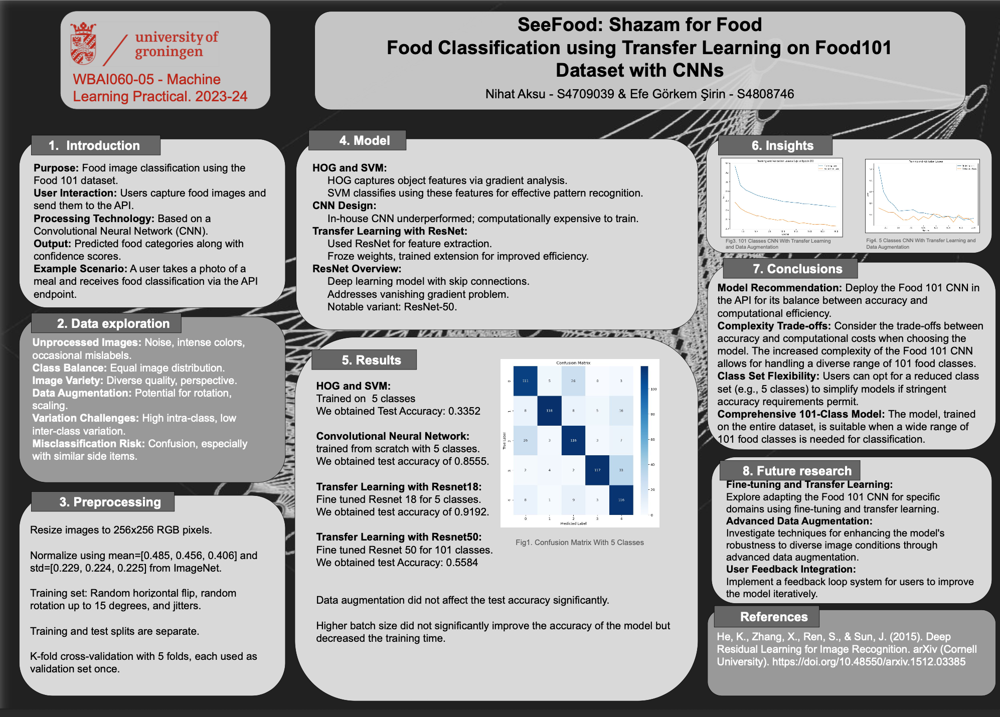

# SeeFood: Food Classification using Transfer Learning on Food101 Dataset with CNNs

## Overview

This project, "SeeFood: Shazam for Food," implements food image classification using the Food 101 dataset. It leverages Convolutional Neural Networks (CNNs) and transfer learning techniques to predict food categories from images. The system is designed to allow users to capture food images, send them to an API, and receive predictions with confidence scores.

This repository contains the code and resources for the "WBAI060-05 - Machine Learning Practical" by Nihat Aksu and Efe Görkem Şirin at the University of Groningen (2023-24).



## Core Functionality

*   **Purpose**: To classify food images from the Food 101 dataset.
*   **User Interaction**: Users can submit food images to an API.
*   **Technology**: Utilizes Convolutional Neural Networks (CNNs), with a focus on ResNet for transfer learning.
*   **Output**: The system provides predicted food categories and associated confidence scores.

## Dataset and Models

*   **Dataset**: The Food 101 dataset is used for training and evaluation. The dataset is **not** stored in this repository; scripts are provided to download it automatically.
*   **Trained Models**: Pre-trained model weights are **not** included in this repository. The models can be trained by running the provided scripts.

## Project Details

### 1. Introduction
The project aims to classify food images efficiently using the extensive Food 101 dataset. It simulates a real-world scenario where a user takes a photo of a meal and receives an instant classification.

### 2. Data Exploration Insights
*   **Image Characteristics**: Raw images often contain noise, varied color intensity, and occasional mislabels.
*   **Class Distribution**: The dataset maintains a balanced distribution across classes.
*   **Data Augmentation**: Techniques like rotation and scaling were considered due to image variety.
*   **Challenges**: The project addressed high intra-class variation (e.g., different preparations of the same dish) and low inter-class variation (e.g., visually similar but different dishes).

### 3. Preprocessing Steps
*   Images are resized to 256x256 RGB pixels.
*   Normalization is performed using ImageNet statistics (mean `[0.485, 0.456, 0.406]` and std `[0.229, 0.224, 0.225]`).
*   Training data augmentation includes random horizontal flips, rotations (up to 15 degrees), and jitters.
*   Distinct training and test splits are maintained.
*   5-fold cross-validation is employed.

### 4. Model Architectures Explored
*   **HOG and SVM**: Initial exploration involved Histogram of Oriented Gradients for feature extraction and Support Vector Machines for classification.
*   **Custom CNN**: An in-house CNN was developed but found to be computationally expensive and less performant.
*   **Transfer Learning with ResNet**:
    *   ResNet (notably ResNet-50) was utilized for feature extraction, leveraging pre-trained weights.
    *   Weights were frozen, and an extension was trained to adapt the model to the food classification task.

### 5. Key Results
*   **HOG and SVM (5 classes)**: Test Accuracy - 0.3352
*   **Custom CNN (5 classes, from scratch)**: Test Accuracy - 0.8555
*   **ResNet18 (5 classes, fine-tuned)**: Test Accuracy - 0.9192
*   **ResNet50 (101 classes, fine-tuned)**: Test Accuracy - 0.5584

*Key Observations:*
*   Data augmentation did not yield significant improvements in test accuracy.
*   Larger batch sizes reduced training time but did not substantially improve model accuracy.

### 6. Conclusions and Recommendations
*   **Model Choice**: The Food 101 CNN (likely referring to the ResNet-based approach) is recommended for API deployment due to its balance of accuracy and computational efficiency.
*   **Trade-offs**: The complexity of the chosen model should be weighed against accuracy and computational resources. A comprehensive 101-class model is suitable for broad classification needs.
*   **Flexibility**: For specific applications or where accuracy requirements are less stringent, a model with a reduced class set (e.g., 5 classes) can be considered.

### 7. Future Research Directions
*   **Enhanced Fine-tuning**: Explore adapting the Food 101 CNN for more specific food domains.
*   **Advanced Data Augmentation**: Investigate sophisticated augmentation techniques to improve robustness.
*   **User Feedback Loop**: Implement a system for iterative model improvement based on user feedback.

### References
*   He, K., Zhang, X., Ren, S., & Sun, J. (2015). Deep Residual Learning for Image Recognition. *arXiv (Cornell University)*. https://doi.org/10.48550/arxiv.1512.03385

## Repository Structure

*(You can add details about your repository's file structure here once you organize it, e.g.,)*
```
/data_handling # Scripts for dataset download and preprocessing
/models        # Model definitions
/training      # Scripts for training the models
/api           # (If applicable) API endpoint code
...
```

## How to Use

1.  **Clone the repository:**
    ```bash
    git clone https://github.com/verynewusername/food-101.git
    cd food-101
    ```
2.  **Set up the environment:**
    *(Add instructions for setting up dependencies, e.g., pip install -r requirements.txt)*
3.  **Download the dataset:**
    *(Point to the script or command to download the Food 101 dataset automatically)*
4.  **Train the models:**
    *(Point to the main training script and any relevant configuration options)*
5.  **(Optional) Run the API / Inference:**
    *(If applicable, provide instructions on how to use a trained model for predictions)*

---
Project by:
*   Nihat Aksu (S4709039)
*   Efe Görkem Şirin (S4808746)

University of Groningen - WBAI060-05 Machine Learning Practical (2023-24)